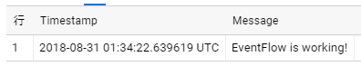

# Mamemaki.EventFlow.Outputs.BigQuery

## Introduction
This is a custom output for [Microsoft.Diagnostics.EventFlow] to insert events into [Google BigQuery] using [BigQuery Storage Write API](https://cloud.google.com/bigquery/docs/write-api).

The general flow of the process:

1. Convert Microsoft.Diagnostics.EventFlow's events([EventData]) to Google BigQuery Storage protobuf message([AppendRowsRequest]) array by your mapper class.
1. If `TableId` has date format strings, expand it.
1. If `AutoCreateTable` enabled, create table if not exists.
1. Call [BigQueryWriteClient.AppendRowsStream.WriteAsync()] to stream insert rows data into BigQuery.

## Getting Started

To quickly get started, you can create a simple console application in VisualStudio as described below or just download and run [PlayGround](PlayGround) project.

### 0. Preparing setup to use BigQuery

- Prepare Dataset. See [Creating and Using Datasets](https://cloud.google.com/bigquery/docs/datasets)
- Prepare ServiceAccount and set private key json file path to `GOOGLE_APPLICATION_CREDENTIALS` environment variable. See [Authentication](#authentication)

### 1. Install NuGet packages

```powershell
PM> Install-Package Microsoft.Diagnostics.EventFlow.Inputs.Trace
PM> Install-Package Mamemaki.EventFlow.Outputs.BigQuery.Storage
PM> Install-Package Microsoft.Diagnostics.EventFlow.Outputs.StdOutput
```

### 2. Add "eventFlowConfig.json"
Add a JSON file named "eventFlowConfig.json" to your project and set the Build Action property of the file to "Copy if Newer". Set the content of the file to the following:

```js
{
  "inputs": [
    {
      "type": "Trace",
      "traceLevel": "Warning"
    }
  ],
  "outputs": [
    {
      "type": "StdOutput"
    },
    {
      "type": "BigQueryStorage",
      "projectId": "xxxxxx-nnnn",
      "datasetId": "xxxxxxxx",
      "tableId": "from_eventflow_{yyyyMMdd}",
      "tableSchemaFile": ".\\tableSchema.json",
      "mapperQualifiedTypeName": "<YourMapperClassTypeName>, <AssemblyName>",
      "autoCreateTable": true
    }
  ],
  "schemaVersion": "2016-08-11",
  "extensions": [
    {
      "category": "outputFactory",
      "type": "BigQueryStorage",
      "qualifiedTypeName": "Mamemaki.EventFlow.Outputs.BigQuery.Storage.BigQueryStorageOutputFactory, Mamemaki.EventFlow.Outputs.BigQuery.Storage"
    }
  ]
}
```

Replace `projectId`, `datasetId`, `mapperQualifiedTypeName` values as your environment.

### 3. Add "tableSchema.json"
Add a JSON file named "tableSchema.json" to your project and set the Build Action property of the file to "Copy if Newer". Set the content of the file to the following:

```js
[
  {
    "name": "Timestamp",
    "type": "TIMESTAMP",
    "mode": "REQUIRED"
  },
  {
    "name": "Message",
    "type": "STRING",
    "mode": "REQUIRED"
  }
]
```

### 4. Create protobuf message proto file
Add event_record.proto to your project. Set the content of the file to the following:

```
syntax = "proto2";

message EventRecord {
  required int64 Timestamp = 1;
  required string Message = 2;
}
```

### 5. Generate protobuf message c# code
Generate protobuf message c# code by following command.

```
protoc -I=./ --csharp_out=./ --csharp_opt=file_extension=.pb.g.cs ./event_record.proto
```

`protoc` command can be installed by nuget package `Google.Protobuf.Tools`.

### 6. Create implementation of IProtobufMessageMapper
Create a class that implements IProtobufMessageMapper for mapping [EventData] to [AppendRowsRequest].
The class implementation is as follows:

```csharp
    internal class EventRecordProtobufMessageMapper : IProtobufMessageMapper
    {
        public DescriptorProto GetDescriptorProto()
        {
            return EventRecord.Descriptor.ToProto();
        }

        public IMessage Map(EventData eventEntry)
        {
            var eventRecord = new EventRecord();
            eventRecord.Timestamp = eventEntry.Timestamp.ToLocalTime().ToUnixTimeMicroseconds();
            if (eventEntry.TryGetPropertyValue("Message", out var message))
                eventRecord.Message = message as string;
            else
                return null;    // Discard no message event
            return eventRecord;
        }
    }
```

[ToUnixTimeMicroseconds()](./PlayGround/DateTimeOffsetExtensions.cs) is a custom extension method.

Replace `mapperQualifiedTypeName` in `eventFlowConfig.json` to your class type name and assembly name. e.g. PlayGround.EventRecordProtobufMessageMapper, PlayGround

### 7. Create an EventFlow pipeline
Create an EventFlow pipeline in your application code using the code below. Run your application and see your traces in console output or in Google BigQuery.
```csharp
    using (var pipeline = DiagnosticPipelineFactory.CreatePipeline("eventFlowConfig.json"))
    {
        System.Diagnostics.Trace.TraceWarning("EventFlow is working!");
        Console.WriteLine("Press any key to exit...");
        Console.ReadKey(intercept: true);
    }
```

Query result in Google BigQuery console:



## Configuration Details

### Output parameters

Parameter  | Description | Required(default)
------------- | ------------- | -------------
`projectId` | Project id of Google BigQuery. | Yes
`datasetId` | Dataset id of Google BigQuery. | Yes
`tableId` | Table id of Google BigQuery. The string enclosed in brackets can be expanded through DateTime.Format(). e.g. "accesslog_{yyyyMMdd}" => accesslog_20181231 | Yes
`timeZoneId` | Time zone id for table id expanding. | No(UTC)
`tableSchemaFile` | Json file that define Google BigQuery table schema. | Yes
`mapperQualifiedTypeName` | The mapper class type name. e.g. "PlayGround.EventRecordProtobufMessageMapper, PlayGround" | Yes
`autoCreateTable` | If set true, check table exsisting and create table dynamically. see [Dynamic table creating](#dynamic-table-creating). | No(false)

### Authentication

This library refers Application Default credentials([ADC](https://developers.google.com/identity/protocols/application-default-credentials)). You can use `GOOGLE_APPLICATION_CREDENTIALS` environment variable to set your ServiceAccount key. See https://cloud.google.com/docs/authentication/getting-started

Your ServiceAccount need permissions as bellow

- `bigquery.tables.updateData`
- `bigquery.tables.create` if use `autoCreateTable`

### Table id formatting

`tableId` accept [DateTime.ToString()] format to construct table id.
Table id's formatted at runtime using the Time zone that specified by the configuration.

For example, with the `tableId` is set to `accesslog_{yyyyMM01}`, table ids `accesslog_20181101`, `accesslog_20181201` and so on.

Note that the timestamp of logs and the date in the table id do not always match,
because there is a time lag between collection and transmission of logs.

### Table schema

There is one method to describe the schema of the target table.

1. Load a schema file in JSON.

On this method, set `tableSchemaFile` to a path to the JSON-encoded schema file which you used for creating the table on BigQuery. see [table schema] for detail information.

Example:
```json
[
  {
    "name": "Timestamp",
    "type": "TIMESTAMP",
    "mode": "REQUIRED"
  },
  {
    "name": "FormattedMessage",
    "type": "STRING",
    "mode": "REQUIRED"
  }
]
```

### Dynamic table creating

When `autoCreateTable` is set to `true`, check to exists the table before insertion, then create table if does not exist. When table id changed, do this sequence again. In other words, no table existing check occurred if not change table id.

## References

* [Google BigQuery]
* [fluent-plugin-bigquery](https://github.com/kaizenplatform/fluent-plugin-bigquery)


[Microsoft.Diagnostics.EventFlow]: https://github.com/Azure/diagnostics-eventflow
[EventData]: https://github.com/Azure/diagnostics-eventflow#eventdata-class
[Google BigQuery]: https://cloud.google.com/bigquery/
[AppendRowsRequest]: https://cloud.google.com/dotnet/docs/reference/Google.Cloud.BigQuery.Storage.V1/latest/Google.Cloud.BigQuery.Storage.V1.AppendRowsRequest
[BigQueryWriteClient.AppendRowsStream.WriteAsync()]: https://cloud.google.com/dotnet/docs/reference/Google.Cloud.BigQuery.Storage.V1/latest/Google.Cloud.BigQuery.Storage.V1.BigQueryWriteClient#Google_Cloud_BigQuery_Storage_V1_BigQueryWriteClient_AppendRows_Google_Api_Gax_Grpc_CallSettings_Google_Api_Gax_Grpc_BidirectionalStreamingSettings_
[table schema]: https://cloud.google.com/bigquery/docs/reference/v2/tables#schema
[DateTime.ToString()]: https://msdn.microsoft.com/en-us/library/vstudio/zdtaw1bw(v=vs.100).aspx
